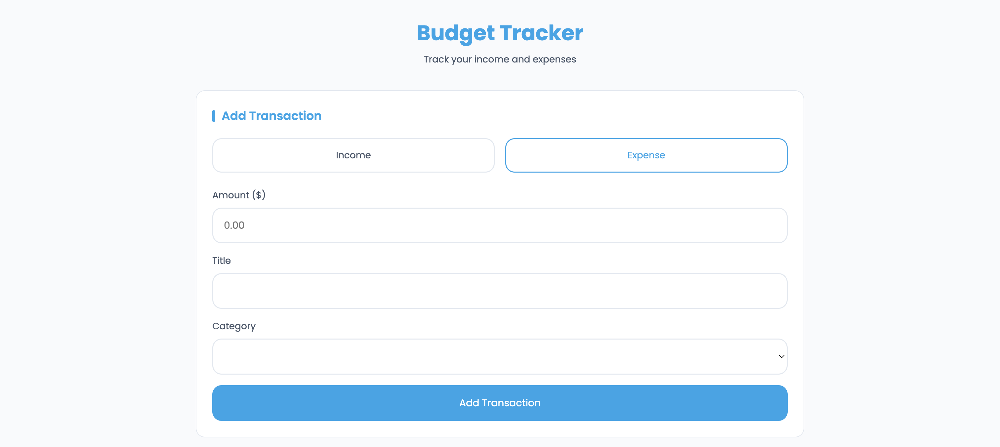
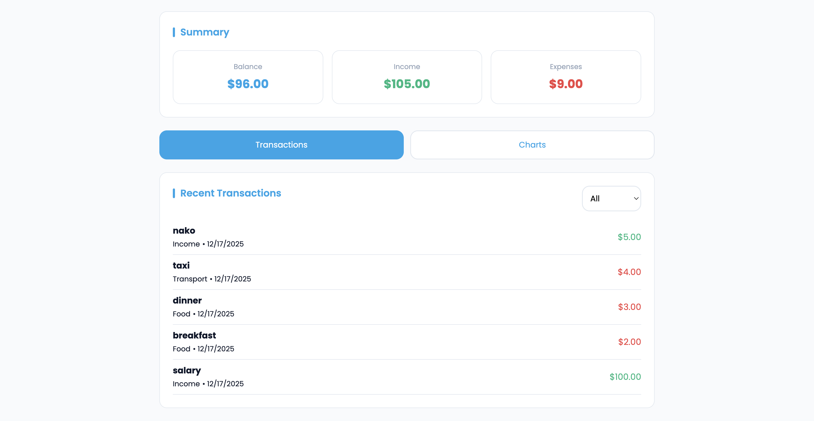
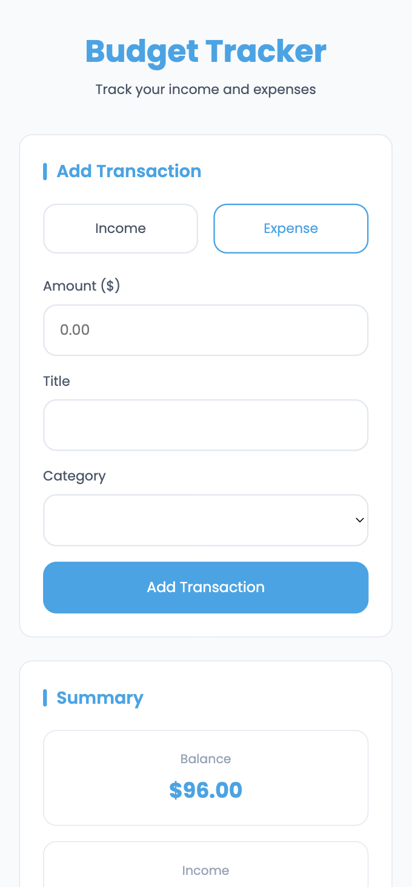
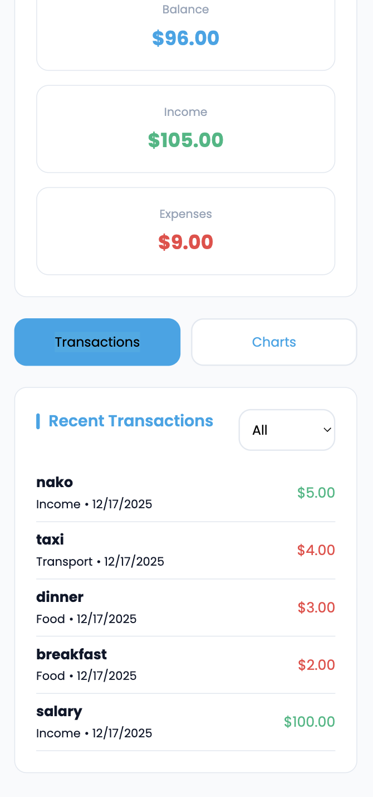
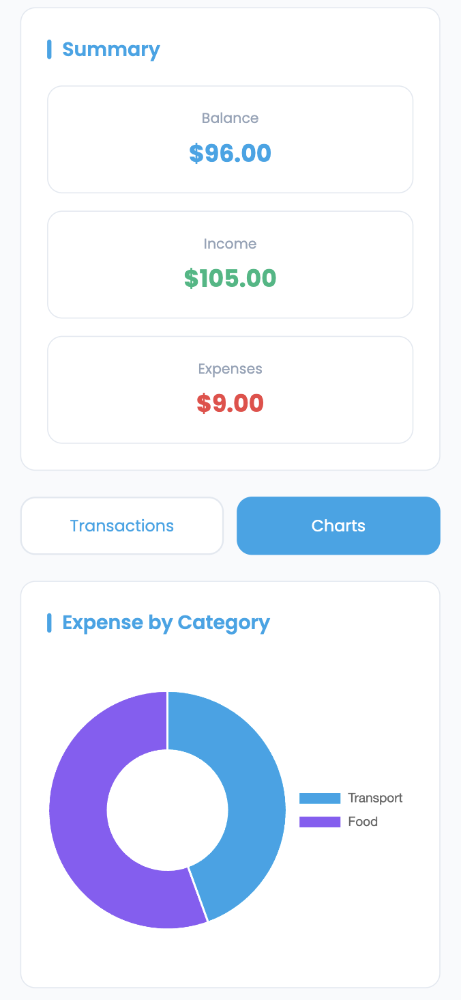

# Assignment 2 - Budget Tracker

## Project Information
**Name:** Non Sorany  
**Project Title:** Budget Tracker  
**Live Demo:** https://rainn22.github.io/hw2/

## Screenshots


### Desktop View




### Mobile View




## Features

- Add transactions (Income or Expense).
- For expenses: choose a category (Food, Transport, Entertainment, Utilities, Shopping, Health, Other).
- Simple validation: amount must be > 0; expense requires a category; title is limited to 30 characters.
- Summary section showing current balance, total income, and total expense.
- Transactions list with date, title, category, and formatted currency amounts.
- Filter transactions by All / Income / Expense.
- Charts tab: doughnut chart showing expense distribution by category.

## Files

- `index.html` — app markup and layout.
- `style.css` — styles and responsive layout.
- `app.js` — application logic: form handling, state, UI rendering, Chart integration.
- `README.md` — document of the code.

## Credits

### Font: Google font Poppins
- https://fonts.google.com/specimen/Poppins
### Chart.js (CDN) 
- https://www.chartjs.org/

## How to run

You can run the app locally:

### Open the app directly
   
   1. Download or clone the repository:
      ```bash
      git clone https://github.com/rainn22/hw2
   2. Open the project folder.
   3. Double-click index.html to open it in your browser.

## Usage

1. Choose transaction type (Income or Expense).
2. Enter an amount (numbers only, cents allowed).
3. (For expenses) choose a category.
4. Optionally enter a title (max 30 characters). If left empty the category will be used as the title.
5. Click "Add Transaction" — the transaction will appear at the top of the Recent Transactions list and the summary will update.
6. Use the tabs to switch to the Charts view and see expense distribution by category.

Notes:
- Data is stored in-memory (a `transactions` array in `app.js`) and is not persisted. Reloading the page clears all transactions.
- Currency formatting uses the browser Intl API and shows USD by default.

## Data shape (for reference)

Example transaction object created in `app.js`:

```json
{
  "id": 1671234567890,
  "type": "expense",
  "amount": 25.5,
  "category": "Food",
  "title": "Lunch",
  "date": "2025-12-17T12:34:56.789Z"
}
```

## Implementation notes

- Validation: amount must be > 0; expense requires a category; title limited to 30 chars.
- Chart: Chart.js is loaded from CDN in `index.html`. The app builds a category -> total mapping and renders a doughnut chart.
- UI: `updateUI()` recalculates totals and re-renders the transactions list and the chart.